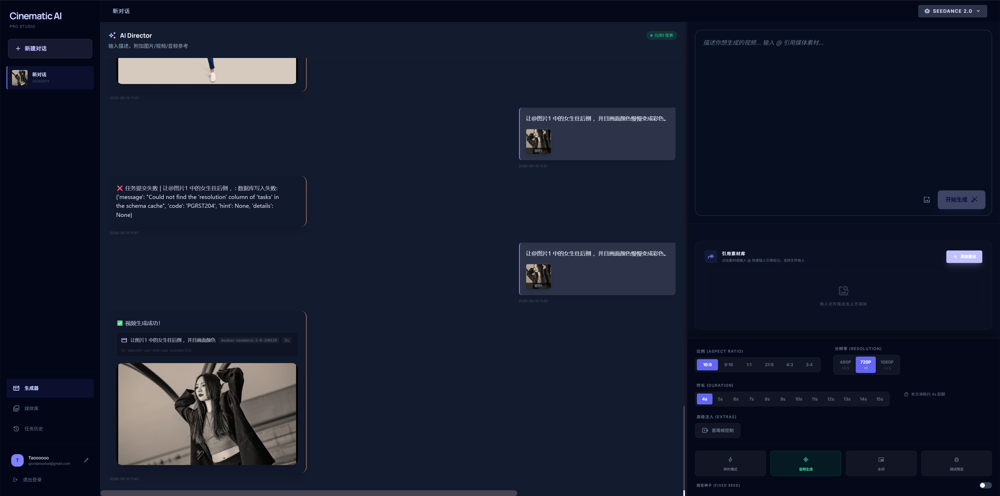
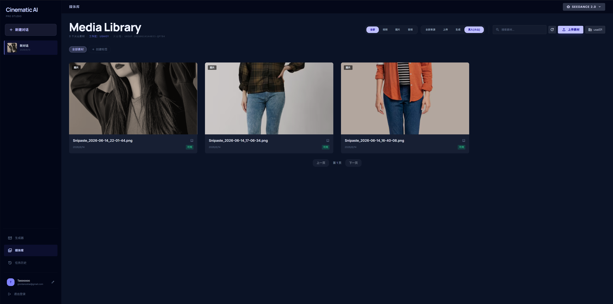
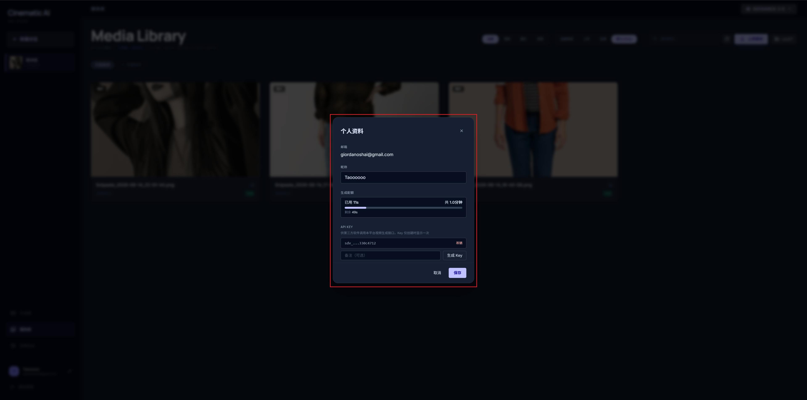
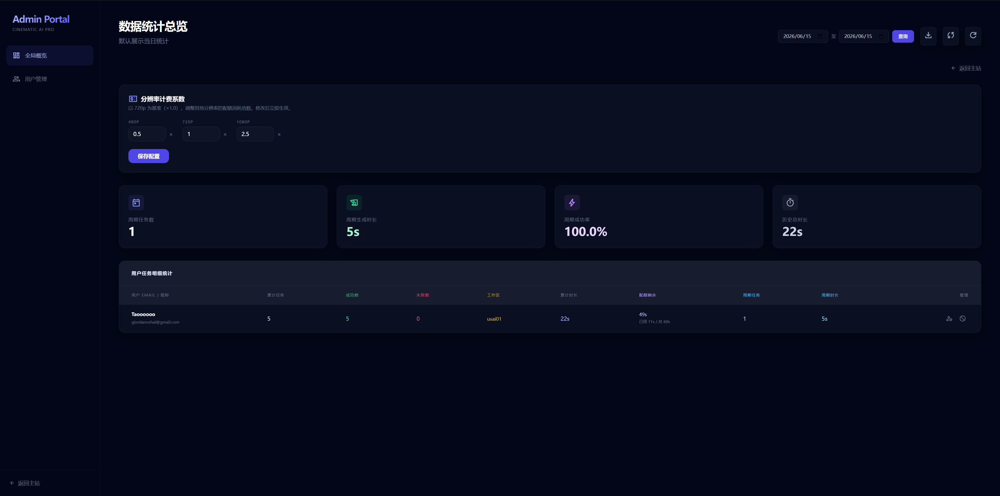

# Seedance 2.0 AI Video Generation Workbench (Lite Open Source)

[](https://fastapi.tiangolo.com)
[](https://www.python.org)
[](LICENSE)

[中文版](./README_CN.md) | **English Version**

A private-deployable, lightweight AI video generation workbench built on **Seedance 2.0**. This Lite open-source version uses local **SQLite3** for data persistence and supports multi-modal reference inputs with zero mandatory cloud dependencies. OSS is optional — reference images work out of the box without any cloud storage.

---

## Lite vs Pro

| Feature | Lite (Open Source) | Pro |
|---------|:-----------------:|:---:|
| Seedance 2.0 video generation | ✅ | ✅ |
| Conversation-based workflow | ✅ | ✅ |
| Media library | ✅ | ✅ |
| Local SQLite storage | ✅ | ✅ |
| OSS-free local mode (reference images) | ✅ | ✅ |
| Reference video / reference audio | Requires OSS | ✅ |
| Multi-user / Workspaces | ❌ | ✅ |
| User quota management | ❌ | ✅ |
| Supabase cloud database | ❌ | ✅ |
| ByteDance real-person asset library | ❌ | ✅ |
| REST API access | ❌ | ✅ |

> Need the Pro version (multi-user, quota management, Supabase)? Contact: giordanoshai@gmail.com
---

## 📸 Screenshots

### Lite Version

#### Main Interface


#### Conversations & History


#### Media Library


### Pro Version Preview

#### Home


#### Media Library


#### User Management


#### Admin Panel


---

## ✨ Features

- 🚀 **Model Support**: Full support for Seedance 2.0 multi-modal protocols (image, video, audio references).
- 💾 **Local Storage**: Lightweight SQLite3 database — no complex infrastructure required.
- ☁️ **OSS Optional**: Without OSS, the app automatically switches to local mode — reference images are sent as base64 directly to the API. Zero barrier to getting started.
- 🖼️ **Auto Preview**: Automatically extracts keyframes and generates thumbnails for all generated videos.
- 🔄 **Async Processing**: Built-in background worker polls task status and saves results to local storage.
- ⚡ **Lightweight**: Single-user mode, no login required, ready out of the box.

---

## 🛠️ Installation & Deployment

### 1. Prerequisites
- Python 3.12+
- **FFmpeg** installed and added to your system PATH (required for video metadata and thumbnail extraction).

### 2. Clone the Repository
```bash
git clone https://github.com/your-username/seedance2.0_api_web_Lite.git
cd seedance2.0_api_web_Lite
```

### 3. Create Virtual Environment & Install Dependencies
```bash
python -m venv .venv

# Windows
.venv\Scripts\activate
# macOS / Linux
source .venv/bin/activate

pip install aiosqlite fastapi httpx jinja2 oss2 pillow pydantic python-dotenv python-multipart uvicorn[standard]
```

### 4. Configure .env

Copy `.env.example` to `.env` and fill in the required fields:

```bash
# Required: Volcengine API Key
SEEDANCE20_KEY=Your_Seedance2.0_Key

# Optional: Alibaba Cloud OSS (leave empty to use local mode)
OSS_KEY_ID=
OSS_ACCESSKEY=
OSS_BUCKET_NAME=
```

#### Two Operating Modes

| Mode | Trigger | Reference Image | Reference Video | Reference Audio |
|------|---------|:--------------:|:---------------:|:---------------:|
| **Local mode** (default) | Leave OSS fields empty | ✅ sent as base64 | ❌ | ❌ |
| **OSS mode** | Fill in OSS_KEY_ID / OSS_ACCESSKEY / OSS_BUCKET_NAME | ✅ | ✅ | ✅ |

> Modes are detected automatically — no manual switch needed.

---

## 🚀 Running the App

```bash
python main.py
# or
uvicorn main:app --host 127.0.0.1 --port 8001 --reload
```

Default URL: `http://127.0.0.1:8001`

---

## 📁 Project Structure

```text
├── app/
│   ├── routers/          # API Routes (task creation, status query, media lib)
│   ├── static/           # Frontend UI (HTML/JS/CSS)
│   ├── template/         # Jinja2 Templates
│   ├── config.py         # Config module (auto OSS_ENABLED detection)
│   ├── database.py       # SQLite3 interactions
│   ├── oss_client.py     # Dual-mode storage (OSS / local + base64)
│   ├── task_worker.py    # Background polling worker
│   └── volcano_api.py    # Volcengine API wrapper
├── data/                 # SQLite database
├── outputs/              # Local videos, thumbnails, and uploaded assets
├── screenshot/           # UI screenshots
├── main.py               # Entry point
└── .env.example          # Configuration template
```

---

## 🤝 Contribution & Feedback

If you find this project helpful, please give it a Star or submit a Pull Request.

---

## ⚠️ Disclaimer

This project is developed based on Volcengine and Seedance APIs. All generative rights belong to the respective creators. Please comply with relevant laws and platform terms during use.
