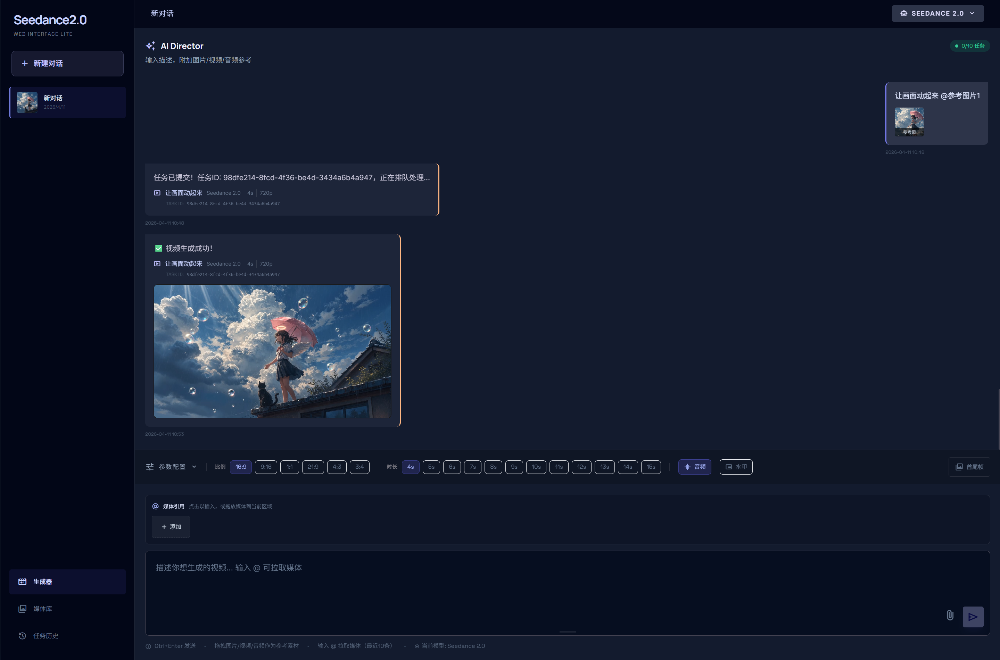
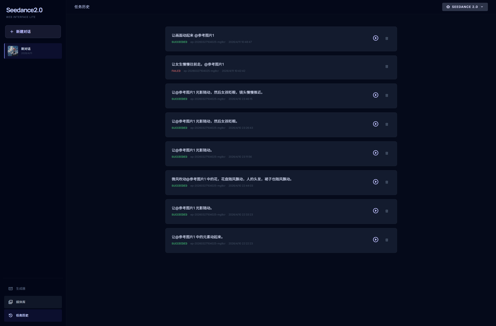
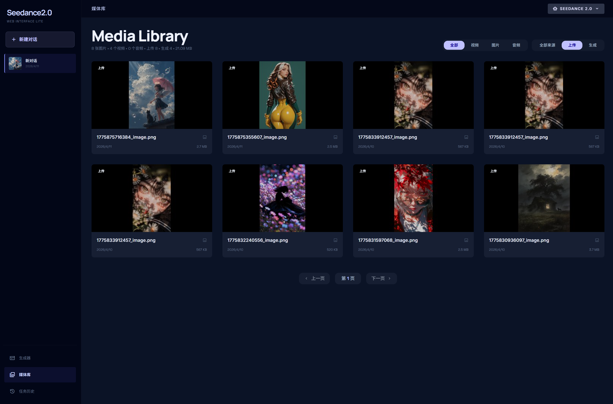

# Seedance 2.0 AI Video Generation Workbench (Lite Open Source)

[](https://fastapi.tiangolo.com)
[](https://www.python.org)
[](LICENSE)

[中文版](./README.md) | **English Version**

A private-deployable, lightweight AI video generation workbench built on **Seedance 2.0**. This Lite version uses local **SQLite3** for data persistence and **Alibaba Cloud OSS** for asset management. It supports multi-modal reference inputs and sophisticated task management.
You will need OSS or publick ipv4 address.
---

## 📸 Screenshots

### Main Interface

*Clean and intuitive console with real-time parameter adjustment and preview.*

### Conversations & History

*Conversation-based management with real-time task polling and status updates.*

### Media Library

*Centralized management of uploaded assets and generated results with automatic thumbnail extraction.*

---

## ✨ Features

- 🚀 **Model Support**: Full support for Seedance 2.0 multi-modal protocols (Image, Video, Audio references).
- 💾 **Local Storage**: Lightweight SQLite3 database for conversations, tasks, and media metadata.
- ☁️ **Cloud Integration**: Leverage Aliyun OSS for reference assets to ensure high availability for API calls.
- 🖼️ **Auto Preview**: Automatically extracts keyframes and generates thumbnails for all generated videos.
- 🔄 **Async Processing**: Built-in background worker to poll task status and auto-save results to local storage.
- ⚡ **Lightweight**: Single-user mode, no login required, zero-configuration startup, perfect for local creators.

---

## 🛠️ Installation & Deployment

### 1. Prerequisites
- Python 3.12+ 
- **FFmpeg** installed and added to your system's PATH (required for video meta & thumbnail extraction).

### 2. Clone the Repository
```bash
git clone https://github.com/your-username/seedance2.0_api_web_Lite.git
cd seedance2.0_api_web_Lite
```

### 3. Create Virtual Environment & Install Dependencies
```bash
# Windows
python -m venv .venv
.venv\Scripts\activate

# Installation
pip install aiosqlite fastapi httpx jinja2 oss2 pillow pydantic python-dotenv python-multipart uvicorn[standard]
```

### 4. Configuration
Create a `.env` file based on `.env.example` in the root directory, or edit `app/config.py` directly:

```bash
# Core Settings
OSS_KEY_ID=Your_Aliyun_AccessKeyId
OSS_ACCESSKEY=Your_Aliyun_AccessKeySecret
OSS_BUCKET_NAME=Your_Bucket_Name
OSS_ENDPOINT=oss-cn-shanghai.aliyuncs.com
OSS_URI=your-bucket.oss-cn-shanghai.aliyuncs.com

ARK_API_KEY=Your_Volcengine_ARK_API_KEY
SEEDANCE20_KEY=Your_Seedance2.0_Exclusive_KEY (optional)
```

---

## 🚀 Running the App

Start the main server:
```bash
python main.py
```
Default access URL: `http://127.0.0.1:8001/static/generator/index.html` (check `main.py` for port/route updates).

---

## 📁 Project Structure

```text
├── app/
│   ├── routers/          # API Routes (Task creation, Status query, Media lib)
│   ├── static/           # Frontend UI (HTML/JS/CSS)
│   ├── template/         # Jinja2 Templates
│   ├── config.py         # Configuration module
│   ├── database.py       # SQLite3 Interactions
│   ├── oss_client.py     # Hybrid Storage (OSS + Local)
│   ├── task_worker.py    # Background Polling Worker
│   └── volcano_api.py    # Wrapped Volcengine API
├── data/                 # SQLite database location
├── outputs/              # Local storage for videos and thumbnails
├── screenshot/           # UI screenshots
├── main.py               # Main entry point
└── pyproject.toml        # Dependency management
```

---

## 🤝 Contribution & Feedback
If you find this project helpful, please give it a Star or submit a Pull Request.

---

## ⚠️ Disclaimer
This project is developed based on Volcengine and Seedance APIs. All generative rights belong to the respective creators. Please comply with relevant laws and platform terms during use.
